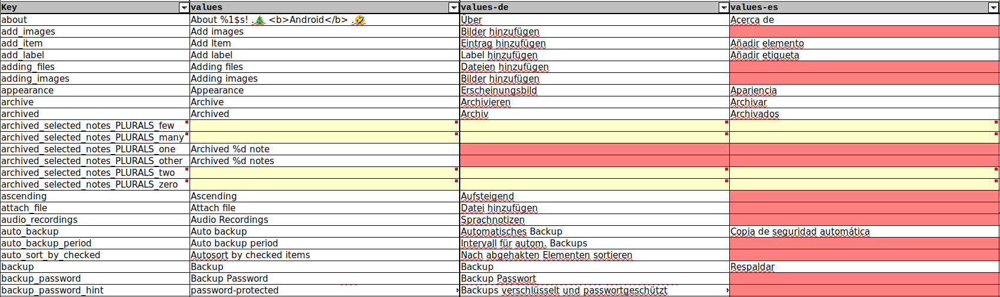

# Android Translations Converter
<a href="https://plugins.gradle.org/plugin/io.github.philkes.android-translations-converter"></a>


Plug'n'Play gradle plugin for your Android projects to convert between Android `strings.xml` translations and Excel.
Useful if your translations are created by non-technical/external translators who prefer to use Excel/LibreOffice.

## Features

* Export from Android project's `strings.xml` files to a single, formatted, reproducible Excel file (`.xlsx`)
* Import `strings.xml` files from given Excel file into corresponding `values` subfolders
* Supports [Android quantity strings (plurals)](https://developer.android.com/guide/topics/resources/string-resource#Plurals)
* Correctly escapes/unescapes special characters + HTML tags in `strings.xml` and Excel
* User-Friendly Excel sheet formatting including highlight missing translations, useful auto-filters and comments
* Auto-Sorts the translations by their key

## Setup

In `build.gradle`:
```groovy
plugins {
    id("io.github.philkes.android-translations-converter") version "1.0.2"
}
```

## Export

Run `./gradlew exportTranslationsToExcel`

Optional configuration in `build.gradle` (shown values are the defaults):
```groovy
tasks.named("exportTranslationsToExcel", ExportToExcelTask) {
    /**
     * Input path which contains 'strings.xml' (or in subfolders)
     */
    inputDirectory = project.file("app/src/main/res")
    
    /**
     * Exported Excel file path (.xlsx)
     */
    outputFile = project.file("translations.xlsx")

   /**
    * Whether the exported Excel sheet should be formatted to make it more user-friendly.
    */
    formatExcel = true
}
```

### Example Excel

To preview a full exported Excel file [download it here](https://github.com/PhilKes/android-translations-converter/raw/refs/heads/main/src/test/resources/expected.xlsx)

 


#### Plurals

Android supports [quantity strings (plurals)](https://developer.android.com/guide/topics/resources/string-resource#Plurals).
To support these plurals, for every `<plurals>` in the `strings.xml` there are multiple for all the supported quantities.
The keys for these plurals have appended `_PLURALS_{QUANTITY}` to differentiate them. There is always a row for every possible quantity, doesn't matter if there is an existing translation in a language or not. If the default language does not specify a translations for a certain quantity, this row is highlighted in yellow with a corresponding comment.


## Import

Run `./gradlew importTranslationsFromExcel`

Optional configuration in `build.gradle` (shown values are the defaults):
```groovy
tasks.named("importTranslationsFromExcel", ImportFromExcelTask) {
   /**
    * Input Excel File containing translations.
    */
    inputFile = project.file("translations.xlsx")

   /**
    * Folder to import into.
    * For every folder-name/language a subfolder will be created and its corresponding `strings.xml` generated.
    */
    outputFile = project.file("src/main/res/")
}
```

To preview the output see [app/src/main/res](./src/test/resources/app/src/main/res) folder

 ---

### Automate Export via pre-commit Hook

The `exportTranslationsToExcel` can easily be automated, in order to always have the exported `translation.xlsx` up-to-date with the Android translations.
This can be done either via a pre-commit hook or by simply executing it on every build.

_Note that `exportTranslationsToExcel` execution is skipped if none of the `strings.xml` files contents have changed since the last execution._

#### Execute on build automatically

In `build.gradle`:
```groovy
preBuild.dependsOn exportTranslationsToExcel
```

#### Add as pre-commit hook

1. Copy [pre-commit folder](./pre-commit) to the root of your project
2. In `build.gradle`:
    ```groovy
    tasks.register('installLocalGitHooks', Copy) {
        def scriptsDir = new File(rootProject.rootDir, 'scripts/')
        def hooksDir = new File(rootProject.rootDir, '.git/hooks')
        from(scriptsDir) {
            include 'pre-commit', 'pre-commit.bat'
        }
        into { hooksDir }
        inputs.files(file("${scriptsDir}/pre-commit"), file("${scriptsDir}/pre-commit.bat"))
        outputs.dir(hooksDir)
        fileMode 0775
    }
    preBuild.dependsOn installLocalGitHooks
    ```
3. Whenever you commit your changes the exported Excel will be kept up-to-date
